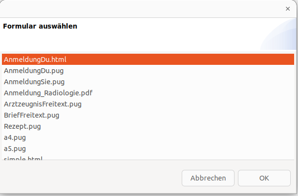
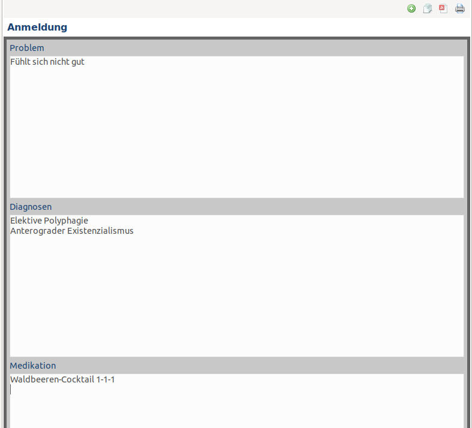
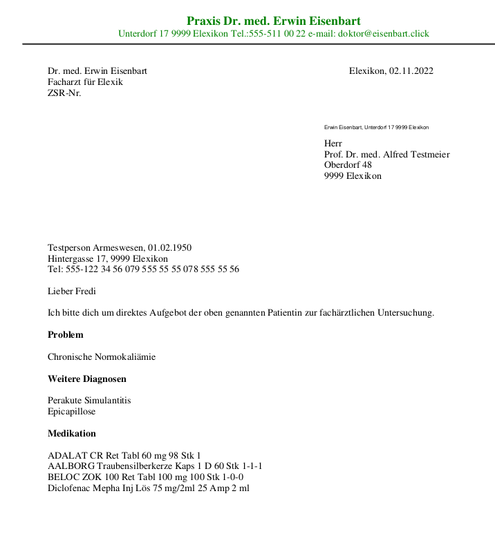
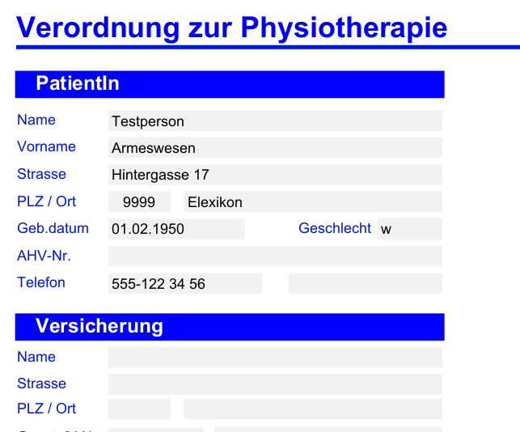

# Ungrad Formulare

Dieses Plugin erlaubt das einfache und schnelle Ausfüllen von Formularen im HTML-, PUG- und PDF-Format ([MedForms](http://medforms.ch)). Es kann damit das jeweilige Textplugin ergänzen oder je nach Anspruch auch ersetzen. Im Unterschoed zum Textplugin muss kein externes Programm genutzt werden, wodurch die Abläufe stabiler und schneller werden. Dafür kann man das Aussehen des Dokuments nur in der Vorlage festlegen und gibt beim Ausfüllen nur reinen Text ohne spezielle Formatierung ein.

## Prinzip

Formulare werden in einem zu definierenden Order vorgehalten. Bei Auswahl eines Formulars werden ausfüllbare Felder angezeigt, und beim Abspeichern wieder ins Formular integriert. Das fertige Formular wird dann als PDF-Datei in einem ebenfalls zu definierenden Ausgangs-Ordner abgelegt. Dieser Speicherort kann auch das Dokumentenverzeichnis sein. Innerhalb des Speicherordners wird das Dokument wie folgt abgelegt:

`speicherort/t/Testperson_Armeswesen_01.02.1955/A_2022-11-01-Zuweisung_Eisenbeiss-Peter.pdf`

(Dies wäre ein Formular mit dem Titel "Zuweisung", welches am 1.11.2022 an einen Peter Eisenbeiss geschickt würde und Testperson Armeswesen betrifft.)

## Einrichtung

Am besten gehen Sie von den [Beispielformularen](https://github.com/rgwch/elexis-ungrad/tree/master/ch.elexis.ungrad.forms/rsc) aus. Kopieren Sie diese Formulare und die beiden .css-Dateien in ein anderes Verzeichnis, z.B. IhreDokumente/elexis/schablonen.

Wenn Sie Vorlagen in der Beschreibungssprache [pug](https://pugjs.org/api/getting-started.html) nutzen wollen, benötigen Sie ein Progamm, das Pug nach html umwandeln kann. Wenn Ihnen das nichts sagt, macht das auch nichts, man kann genauso gut mit html-Formularen arbeiten. Als Beispiel finden Sie "AnmeldungDu.html", das einfach die compilierte Version von AnmeldungDu.pug ist, und das Sie als Ausgangspunkt für eigene HTML-Formulare verwenden können-.

Gehen Sie auf Datei-Einstellungen-Datenaustausch-Forms und geben Sie die Verzeichnisse, und -falls vorhanden- das Pug-Programm ein,

## Verwendung: HTML Formulare

Öffnen Sie die View "Forms View" und klicken Sie auf das grüne "+" Symbol, um eine Liste der Vorlagen zu erhalten.

Doppelklick auf die gewünschte Vorlage öffnet die Formular-Sicht (In diesem Beispiel ergibt AnmeldungDu.hml und AnmeldungDu.pug exakt dasselbe Formular; sie brauchen nur eine davon):

Zum Abschluss klicken Sie auf das Druckersymbol, um die PDF-Sicht zum Ausdrucken oder Mailen zu erhalten:

## Verwendung: Medforms Formulare

Das Plugin verarbeitet auch [Medforms](https://www.medforms.ch/) Formulare. Das sind PDF Dateien mit Standardkonformen Formularfeldern. Ungrad Forms kann die Felder, die den aktuelll ausgewählten Patienten betreffen, vorab abfüllen. In diesem Fall wird nicht die Formularsicht in der Forms-View geöffnet, sondern direkt der PDF-Viewer mit dem Vorabgefüllten Formular:

