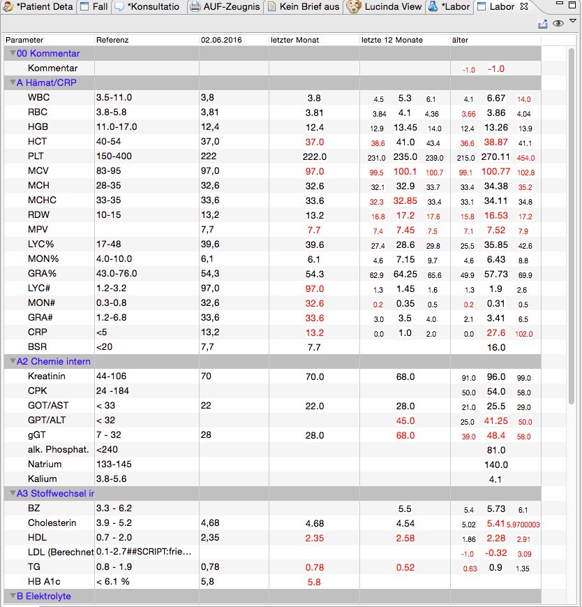
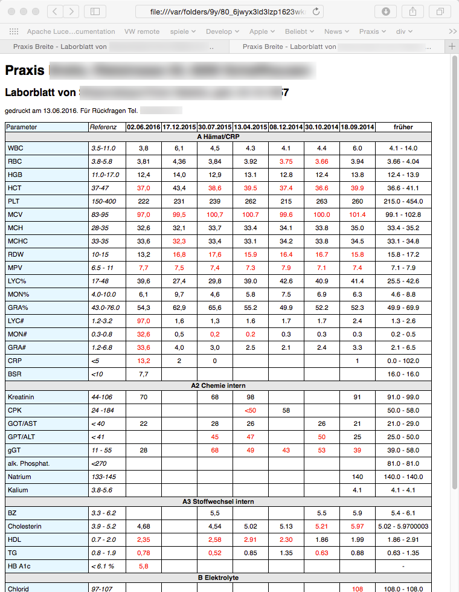

# Ungrad Labview

## Zusammenfassung

Eine alternative Labor-Ansicht mit folgenden Eigenschaften:

### Übersichts-Modus

Nur die aktuellsten Laborwerte werden konkret gelistet, alle älteren in Form von min-avg-max- Darstellungen.
Dadurch können relvante Informationen auf einen Blick und ohne Blättern erfasst werden.

### Detail-Modus 

Tabellarische Ansicht wie gewohnt
 
### HTML Export

Der Export erfolgt in eine wesentlich attraktivere Darstellung, die zudem vom Anwender konfigurierbar ist. 

  
 ## Installation
  
 Ungrad Labview kann über die Elexis-Ungrad Softwaresite installiert werden.
  