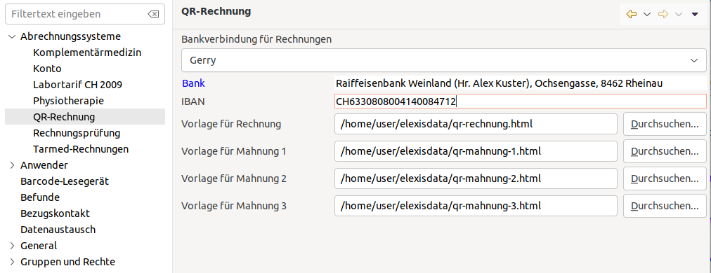
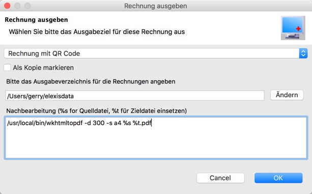

# QR-Rechnungen

## Wozu?

Ab 2018 wurde in der Schweiz schrittweise der ISO 20022 Standard zur automatisierten Zahlungsverarbeitung eingeführt.
Für uns einfache Leute am wichtigsten sind erstens die Zahlungseingangs-Dateien, welche vom bisherigen zeilenbasierten ESR-Format
auf ein XML-basiertes Format umgestellt wurden.
Elexis kann in der Version 3.4/Ungrad2018  solche Dateien bereits verarbeiten. Achtung: Mit früheren Elexis Versionen können Sie Zahlungen nur noch so lange automatisch verbuchen, bis Ihre Bank auf Iso 20022 umgestellt hat.

In einem zweiten Schritt, der auf Mitte/Ende 2018 angekündigt ist, sollen auch die Einzahlungsscheine geändert werden. Anstelle des Roten/rosa ESR-Teils soll ein auf beliebiges Papier druckbarer QR-Code kommen. Das scheint auf den ersten Blick zunächst mal eine Verbesserung: Es erspart uns, Drucker mit zwei Schächten anzuschaffen und zwei Sorten Papier vorzuhalten.

Allerdings schreibt der Standard vor, dass der Zahlteil mit einer Perforation vom oberen Teil abzutrennen ist. Wir brauchen also doch verschiedene Papiertypen. Nur wenn die Rechnung als PDF versandt wird, gilt auch eine gestrichelte Linie und ein Hinweis in Form eines Scherensymbols oder des Texts "Vor dem Einzahlen abzutrennen" als zulässig.

*Achtung*: Das Datenformat wurde geändert. Die mit Elexis Ungrad 2018 erstellbaren QR-Codes sind nicht mehr gültig. Aktuell gilt das Format 2.0. Sie müssen also zumindest das QR-Plugin auf Ungrad2020 updaten, falls Sie schon eine frühere Version verwendet haben. 
 
## Installation

 Sie können ch.elexis.ungrad.qrbills über die Software-Installation in Elexis Ungrad 2018, 2020 oder Elexis 3.7 installieren.
 Ausserdem muss das Feature "Elexis Swiss OpenSource Feature" aus der Gruppe "Basispakete" installiert sein.

## Konfiguration

 QrBills benötigt die qrIBAN Nummer Ihres Kontos (Das ist nicht dieselbe, wie die "alte" IBAN!). Gehen Sie auf Datei-Einstellungen - Abrechnungssysteme - QR-Rechnung und geben Sie die entsprechenden Daten ein. Nebst der qrIBAN werden Vorlagen für Rechnungen und Mahnungen benötigt. Dies wird weiter untern erläutert.
 
 

 Beachten Sie, dass die derzeitige Spezifikation QR-Rechnung von ISO 20022 nur IBAN-Nummern mit CH und LI Präfix zulässt.
 
 Sie können dieses Plugin zur Rechnungsausgabe für jedes andere Abrechnungssystem verwenden:
 
 
 

## Nutzung
 
 Wählen Sie bei der Rechnungsausgabe das Ziel "Rechnung mit QR-Code". Im Feld darunter tragen Sie das Verzeichnis ein, in das die Rechnungen geschrieben werden sollen. 
 
 
 
 Die Rechnungen werden als id.pdf geschrieben, wobei für ID die Rechnungsnummer eingesetzt wird. 
 


## Mögliche Probleme
 
Der Ausdruck einer PDF-Datei ist nicht immer perfekt. Häufig spielen uns "intelligente" Optimierungen einen Streich. So versuchen manche Druckertreiber, die Seite zu verkleinern, damit sie in den Druckbereich (Seite ohne Ränder) des Druckers passt. Dies darf im Fall der QR-Rechnung aber nicht passieren, da die Grösse und Position aller Elemente innerhalb enger Grenzen vorgeschrieben ist. Kontrollieren Sie das, indem Sie nach einem Probeausdruck nachmessen, ob der "Zahlteil" wirklich Format A6 ist (148x105mm), und ob er wirklich in der rechten unteren Ecke der Seite (nicht des Druckbereichs!) platziert ist.
 
Wenn die Positionierung und Grösse nicht stimmt, damm kommen automatische Verarbeitungssysteme damit nicht zurecht, was für Sie zu erhöhten Verarbeitungskosten führen kann.

Lesen Sie dann den QR Code mit irgendeiner QR-Applikation auf Ihrem Smartphone ein und prüfen Sie, ob die Rechnungsdaten korrekt eingelesen werden. Die ersten drei Zeilen müssen SPC, 0200 und 1 sein, darunter folgen die IBAN und die weiteren Rechnungsdetails, hier ein Beispiel:

```
SPC
0200
1
CHxxxxxxxxxxxxxxxxxx
K
Eisenbart Doktor
Hintergasse 55
9999 Elexikon


CH


155.15
CHF
K
Testperson Armeswesen
Hintergasse 17
9999 Elexikon


CH
QRR
000000000000000000000456007

EPD
```

(Die Papierversion dieser Rechnung sehen Sie unter [example.pdf](./example.pdf) )

## Vorlagen

Sie können das Aussehen der Rechnungen und Mahnungen selbst bestimmen. Nur das Aussehen des Zahlungs-Abschnitts ist genau vorgeschrieben. 

Wir verwenden hier HTML-Dateien als Vorlagen. Sie können solche Dateien mit einem gewöhnlichen Texteditor oder einem speziellen HTML-Editor verändern. An sich kann beim Experimentieren nicht viel kaputtgehen. Schlimmstenfalls wird nichts mehr oder eine ungültige Datei ausgedruckt. Gehen Sie dann einfach wieder zur Ausgangsdatei zurück.

Es ist empfehlenswert, wenn Sie zunächst die [Vorlage](../rsc/qrbill_template_v3.html) herunterladen und z.B. als 'qr-rechnung.html' irgendwo abspeichern.

Auf der sicheren Seite sind Sie, wenn Sie in dieser Vorlage zunächst nur diesen Teil hier verändern (Sie müssen dazu ziemlich weit, bis ins unterste Drittel, hinunterscrollen):

```html
 <!-- *******************************************************************************************************
      User-modifiable part starts here 
      ********************************************************************************************************* -->
    <div id="header">
      <h1>Praxis [Mandant.Titel] [Mandant.Vorname] [Mandant.Name]</h1>
      <span>[Mandant.Strasse] [Mandant.Plz] [Mandant.Ort] Tel.: [Mandant.Telefon1] e-mail: [Mandant.E-Mail]</span>
      <hr />

    </div>
    <div id="date">
      [Mandant.Ort], [Datum.heute]
    </div>

    <div id="sender">
      [Mandant.Titel] [Mandant.Vorname] [Mandant.Name]
      <br /> Facharzt für [Mandant.TarmedSpezialität]
      <br /> ZSR-Nr. [Mandant.KSK]
    </div>

    <div id="address">
      [Adressat.Anschrift]
      <br />
    </div>

    <div id="bill_summary">
      <table>
        <tr>
          <td colspan="2">
            Für: [Patient.Name] [Patient.Vorname], [Patient.Geburtsdatum]
          </td>
        </tr>
        <tr>
          <td width="100%">
            Rechnungs-Nummer:
          </td>
          <td>
            [Rechnung.RnNummer]
          </td>
        </tr>
        <tr>
          <td>Rechnungs-Datum:</td>
          <td>[Rechnung.RnDatum]</td>
        </tr>
        <tr>
          <td>Behandlungen von:</td>
          <td>[Rechnung.RnDatumVon]</td>
        </tr>
        <tr>
          <td>Behandlungen bis:</td>
          <td>[Rechnung.RnDatumBis]</td>
        </tr>

      </table>
    </div>
    <div id="maintext">
      <h1>Honorar-Rechnung</h1>
      <p>Diese Seite ist für Ihre Unterlagen bestimmt. Bitte senden Sie den beiliegenden Rückerstattungs-Beleg an
        Ihre Krankenkasse.
        Bitte um Begleichung innert 30 Tagen.
      </p>
    </div>

    <!-- ***************************************************************************************** 
      User-modifiable part ends here 
     ********************************************************************************************* -->
```
Verändern Sie den Text nach Ihrem Geschmack und machen Sie einen Ausdruck. Prüfen Sie genau, ob die Rechnung wie erwartet aussieht, und messen Sie auch den unteren Abschnitt nochmals aus. Er muss 105mm hoch sein, und der QR-Code sollte 46mm messen.

Wenn alles nach Ihren Wünschen aussieht, kopieren Sie die fertige qr-rechnung.html nach qr-mahnung-1.html und ändern Sie dort nur die Zeilen, die bei der Zahlungserinnerung anders aussehen sollen. Verfahren Sie gleich für qr-mahnung-2.html und qr-mahnung-3.html. Konfigurieren Sie dann das QR Plugin wie eingangs gezeigt, so dass es auf diese Vorlagen zurückgreift.

